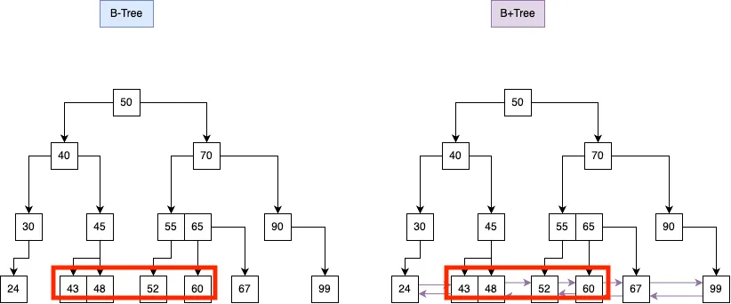

인덱스
==

## 인덱스란?

> 추가적인 쓰기 작업과 저장 공간을 활용해 DB 테이블의 검색 속도를 향상시키기 위한 자료 구조

- 일종의 책갈피, 인덱스가 올바르게 설정되어 있지 않다면 풀 스캔이 진행
- 인덱스는 항상 최신의 정렬 상태로 유지해야 빠른 탐색이 가능
    - INSERT, UPDATE, DELETE 쿼리 실행 시 아래와 같은 추가 연산으로 오버헤드 발생
        - INSERT: 새로운 데이터에 대한 인덱스 추가
        - UPDATE: 기존의 인데스를 사용하지 않음 처리, 갱신된 데이터에 대해 인덱스를 추가
        - DELETE: 삭제 데이터의 인덱스를 사용하지 않는다는 작업 진행

---

### 인덱스의 종류

클러스터드 인덱스

- 데이터가 테이블에 물리적으로 저장되는 순서를 정의(pk)
- UUID 같이 정렬되지 않은 키 사용 시 추가적 리소스 발생
- 테이블당 하나의 클러스터드 인덱스만 존재
- 리프노드에 데이터를 저장

논 클러스터드 인덱스

- 리프 노드에 데이터의 주소가 저장되어 있어, 주소를 이용해 데이터를 찾은 추가 작업 필요
- 데이터 페이지는 정렬되어있지 않음, 여러개의 인덱스 생성 가능

```text
커버링 인덱스
논 클러스터드 인덱스 사용시 발생하는추가적인 작업 없이 데이터를바로 가져오는 방법
즉, 원본 데이터에 추가 접근 없이 필요 정보를 인덱스에서 바로 가져올 수 있는 인덱스
```

---

### 장점

- 테이블 조회 속도 향상으로 전반적인 시스템의 부하를 줄임

### 단점

- 인덱스 관리를 위한 추가 작업 및 저장공간 필요
- 인덱스를 잘못 사용할 경우 성능 저하 발생
    - CREATE, UPDATE, DELETE 가 빈번한 컬럼에 인덱스 지정 시 DELETE, UPDATE 연산으로 인덱스의 크기가 비대해져 성능이 저하되는 역효과 발생

---

### 인덱스를 사용하면 좋은 경우

- 규모가 큰 테이블
- INSERT, UPDATE, DELETE 가 빈번하지 않은 컬럼
- JOIN 이나 WHERE 또는 ORDER BY에 자주 사용되는 컬럼

---

### 인덱스 구현

- HashTable
    - key, value 형태, 해시 함수로 Key를 생성해 해당 Key 값으로 데이터를 조회 o(1)
    - 범위 검색에 효율이 떨어짐
    - 해시 충돌 발생의 위험 존재
- B-Tree
    - 각 노드는 여러 개의 키를 가지며 오름차순으로 정렬
    - 이진 트리의 확장구조로 자식 노드를 2개 이상 가질 수 있음
    - 가질 수 있는 노드를 확장해 트리의 깊이를 낮춰 범위 검색에 효울적 o(lon(N))
- B+Tree
    - B+Tree 보다 검색 연산과, 범위 검색에 유용
    - 리프 노드간의 연결성이 추가됨

