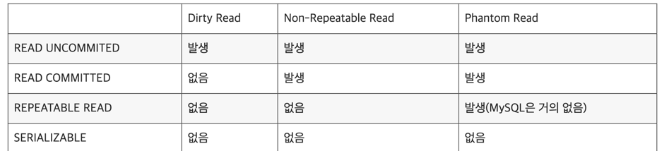

트랜잭션의 격리 수준
==
여러 트랜잭션이 동시에 처리될 때, 특정 트랜잭션이 다른 트랜잭션의 변경 및 조회 하는것을 허용할지의 여부를 결정하는 것

트랜잭션의 격리 수준 (격리 수준이 높은 순서)
- SERIALIZABLE
- REPEATABLE READ
- READ COMMITTED
- READ UNCOMMITED

---
## SERIALIZABLE

> 가장 안전하나, 가장 성능이 떨어짐

- 가장 엄격한 격리 수준으로 데이터 부정합 문제가 없음
- 트랜잭션을 순차적으로 처리해 여러 트랜잭션이 동일한 레코드에 동시 접근 불가
- 동시 처리 성능이 떨어짐

MySQL에서 SELECT FOR SHARE/UPDATE는 대상 레코드에 읽기/쓰기 잠금을 걸지만, 순수 SELECT 작업에는 아무런 잠금 없이 실행됨

하지만 SERIALIZABLE 격리 수준에서는 순수 SELECT 작업에도 대상 레코드에 넥스트 키 락을 읽기 잠금(공유략, s-lock)을 건다.

따라서 한 트랜잭션에서 넥스트 키 락이 걸린 레코드는 다른 트랜잭션에서는 절대 추가/수정/삭제가 불가.

---

## REPEATABLE READ

- MVCC로 인해 한 트랜잭션 안에서 동일한 결과를 보장하나 새로운 레코드 추가 시 부정합 발생 가능
- 트랜잭션 번호를 참고해 자신보다 먼저 실행된 트랜잭션의 데이터만을 조회
  - 트랜잭션 안에서 실행되는 SELECT는 항상 일관된 데이터 조회
  - 트랜잭션 없이 실행 시 데이터의 정합성이 깨질 수 있음.

#### MVCC(Multi-Version Concurrency-Controller, 다중 버전 동시성 제어)

- 대부분의 RDBMS는 변경 전 레코드를 언두 공간에 백업해 변경 전/후 데이터가 존재해 동일한 레코드에 여러 버전의 데이터가 존재한다는 개념
- 트랜잭션 롤백 시 데이터 복원 및 트랜잭션 간 접근할 수 있는 데이터의 세밀한 제어 가능
- 트랜잭션 번호를 함께 저장 후 해당 데이터 불필요할 시 주기적으로 백그라운드 스레드로 삭제

> tx-a가 id = 1 레코드를 조회해 종료 전 tx-b가 같은 레코드를 수정 시 MVCC를 통해 기존 데이터(테이블)은 변경되나 백업 데이터가 언두 로그에 존재한다.
> 
> 이때 종료되지 않은 상태의 tx-a가 다시 동일한 SELECT를 실행하면 트랜잭션 번호를 참고해 자신보다 먼저 실행된 트랜잭션의 데이터만을 조회한다.
> 
> 만약, 테이블에 자신보다 이후에 실행된 트랜잭션 데이터 존재 시 언두 로그를 참고해 데이터 조회한다.
>
> 즉, tx-b는 tx-a보다 나중에 실행되었기에 조회 결과는 수정 이전 데이터를 조회

#### Phantom Read

- SELECT 조회시 트랜잭션이 끝나기 전 다른 트랜잭션이 레코드를 추가/삭제 시 발생
  - MVCC 덕분에 자신보다 나중에 실행된 트랜잭션이 추가한 레코드는 무시하기에 일반적인 조회에서는 발생하지 않음
- 일반적으로 REPEATABLE READ 수준에서는 발생하지 않음
> tx-a가 시작되어 잠금없는 SELECT으로 데이터 조회, tx-b가 데이터 INSERT로 추가 이때 잠금이 없어 바로 COMMIT 된다.
> 
> 그리고 tx-a가 SELECT FOR UPDATE로 조회시 언두 로그가 아닌 테이블에서 레코드를 조회하기에 Phantom Read 발생(하지만 이런 경우는 거의 앖다고 함).

정리

- SELECT FOR UPDATE 이후 SELECT : 갭락으로 인해 팬텀리드 x
- SELECT FOR UPDATE 이후 SELECT FOR UPDATE : 갭락으로 인해 팬텀리드 x
- SELECT 이후 SELECT : MVCC 덕분에 팬텀리드 x
- SELECT 이후 SELECT FOR UPDATE : 팬텀 리드 발생

---

## READ COMMITTED

- 커밋된 데이터만 조회
- Phantom Read, Non-Repeatable Read(반복 읽기 불가능) 문제 발생

> tx-a가 id = 2 레코드를 변경 후 커밋 전이며, 테이블은 먼저 갱신시 tx-b가 같은 레코드를 조회하면 언두 로그에서 데이터를 조회한다. 
> 
> 하지만, tx-a가 변경 데이터 커밋 후 tx-b가 다시 조회 시 변경된 데이터가 조회되어 결과가 달라지는 Non-Repeatable 문제가 발생할 수 있다.

#### Non-Repeatable Read(반복 읽기 불가능)

- 동일한 결과를 보장하지 않음

--- 

## READ UNCOMMITTED

- 커밋하지 않은 데이터에도 접근 가능한 수준
- Dirty Read 문제로 시스템에 혼란을 줄 수 있음

#### Dirty Read

- 한 트랜잭션의 작업이 완료되지 않아도 다른 트랜잭션에서 볼 수 있는 부정합 문제 

---

## 정리 및 요약

- SERIALIZABLE : 동시성 처리 성능이 매우 떨어짐
- READ UNCOMMITTED : 부정합 문제가 심함
- READ COMMITTED : 권장, Oracle 기본 사용
- REPEATABLE : 권장, MySQL 기본 사용

---

# 참고 및 출처

https://mangkyu.tistory.com/299