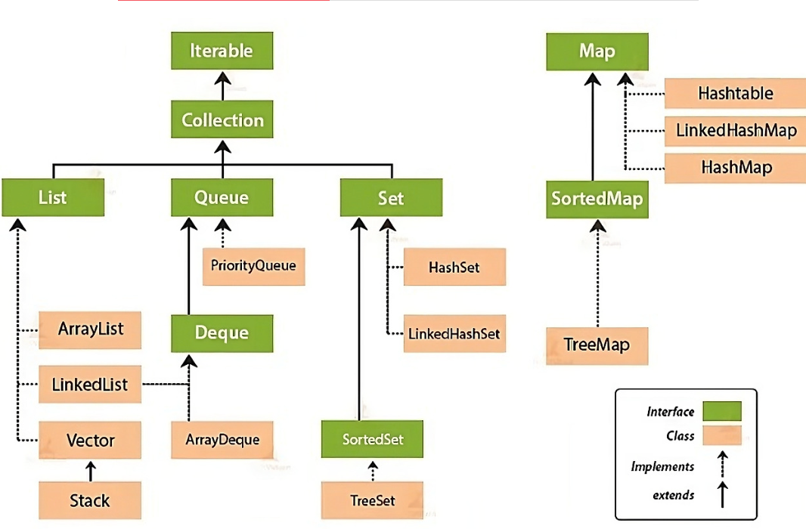

컬렉션 프레임워크란?
==

- 자료 구조와 알고리즘을 구조화해 자바 클래스로 구현한 모음집

## 장점

- 인터페이스와 다형성을 이용해 객체지향적 설계를 통해 표준화되어 재사용성이 높음
- 데이터 구조 및 고성능 알고리즘 구현을 제공해 프로그램의 성능과 품질 향상
- 상위 인터페잇 타입으로 업캐스팅해 사용 ->  상호 운용성 제공

## 종류

- Collection 인터페이스와 Map 인터페이스로 나뉨
    - List 와 Set 인퍼페이스를 구현한 컬렉션 클래스들은 공통된 부분이 많아 공통 부분을 모아 Collection 인터페이스로 상속
    - Map 인터페이스 컬렉션들은 두개의 데이터를 묶어 하나로 다루기에 Collection 인터페이스와 따로 분리

---

## Iterable 인터페이스

- 컬렉션 인터페이스들의 가장 최상위 인터페이스
  Map 인터페이스는 Iterable 인텊에스를 상속받지 않고 있기에 iterator(), splierator() 메서드 구현이 없다.

| 메서드                                            | 설명                  |
|------------------------------------------------|---------------------|
| default void forEach(Consumer<? super> action) | 함수형 프로그래밍 전용 루프 메서드 |
| Iterator<T> iterator()                         | 컬렉션에서 이터레이터를 구현     |
| default Spliterator<T> spilerator()            | 파이프라이닝 관련 메서더드      |

---

## Collection 인터페이스

- List, Set, Queue에 상속을 하는 실질적 최상위 컬렉션 타입
- 업캐스팅으로 다양한 종류의 컬렉션 자료형을 받아 자료 삽입, 삭제, 탐색 기능 가능(다형성)

| 메서드                                 | 반환 타입         | 설명                                      |
|-------------------------------------|---------------|-----------------------------------------|
| `add(E e)`                          | `boolean`     | 컬렉션에 요소 `e`를 추가. 성공하면 `true` 반환         |
| `addAll(Collection<? extends E> c)` | `boolean`     | 주어진 컬렉션 `c`의 모든 요소를 현재 컬렉션에 추가          |
| `clear()`                           | `void`        | 컬렉션의 모든 요소를 제거                          |
| `contains(Object o)`                | `boolean`     | 컬렉션에 특정 요소 `o`가 포함되어 있는지 확인             |
| `containsAll(Collection<?> c)`      | `boolean`     | 주어진 컬렉션 `c`의 모든 요소가 현재 컬렉션에 포함되어 있는지 확인 |
| `isEmpty()`                         | `boolean`     | 컬렉션이 비어 있는지 여부 반환 (`true`이면 비어 있음)      |
| `iterator()`                        | `Iterator<E>` | 컬렉션의 요소를 반복할 수 있는 `Iterator` 객체 반환      |
| `remove(Object o)`                  | `boolean`     | 컬렉션에서 특정 요소 `o`를 제거                     |
| `removeAll(Collection<?> c)`        | `boolean`     | 컬렉션에서 주어진 컬렉션 `c`의 모든 요소를 제거            |
| `retainAll(Collection<?> c)`        | `boolean`     | 현재 컬렉션에서 `c`에 없는 요소를 모두 제거 (교집합 유지)     |
| `size()`                            | `int`         | 컬렉션의 요소 개수를 반환                          |
| `toArray()`                         | `Object[]`    | 컬렉션의 모든 요소를 포함하는 배열을 반환                 |
| `toArray(T[] a)`                    | `T[]`         | 지정된 타입의 배열로 변환 후 반환                     |

--- 

## 출처와 참고

https://inpa.tistory.com/entry/JCF-%F0%9F%A7%B1-Collections-Framework-%EC%A2%85%EB%A5%98-%EC%B4%9D%EC%A0%95%EB%A6%AC#java_collection_framework